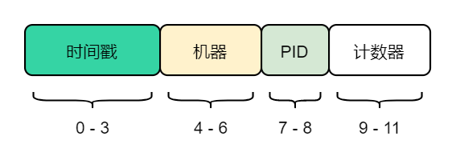

## ObjectId 是什么？

一句话，ObjectId 是 MongoDB 文档 _id（主键）的默认类型。

## ObjectId 的组成？



> ObjectId 使用 12 字节的存储空间，是一个由 24 个十六进制数字组成的字符串 （每个字节可以存储两个十六进制数字）。

```json
{
    "_id" : ObjectId("5e7dc34c416808cf7da6679d"),
    "name" : "小明",
    "sex" : "男"
}
```

**时间戳**：从标准纪元开始的时间戳，单位为秒

**机器**：所在主机的唯一标识符，通常是机器主机名的哈希值

**PID**：产生 ObjectId 的进程的进程标识符

**计数器**：自动增加的计数器，确保相同进程同一秒产生的 ObjectId 不一样。一秒钟最多允许每个进程创建2^24-1个不同的 ObjectId

## ObjectId 的那些事！

### 大致会按照插入的顺序排列，仅仅是“大致”

由于时间戳在前面，所以 ObjectId 大致会按照插入的顺序排列，但不是绝对的

由于存储时间只精确到秒，同一机器，同一秒，不同进程生成的 ObjectId，PID小的会排在大的前面。

### 同一进程一秒内生成的 ObjectId 数量是有限的

由于计数器占3个字节，所以可以表示的数量为2^24

## Reference

MongoDB权威指南（第2版）

[关于MongoDB ObjectId，你应该知道的](https://www.jianshu.com/p/7c4bfa516acf)

