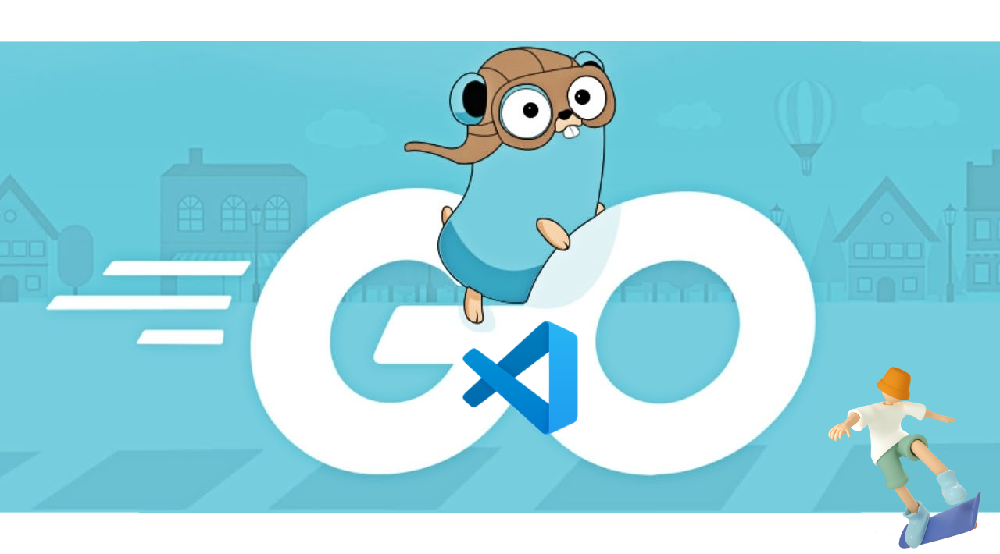
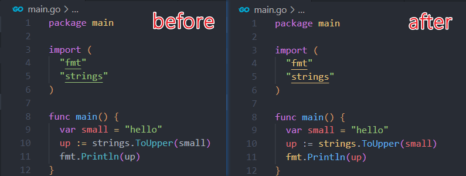
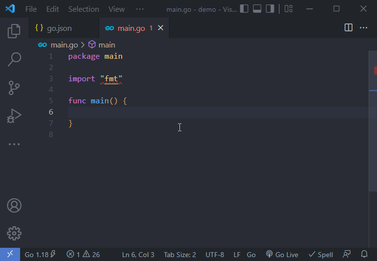

# 打造高效的 VSCode Go 环境



## 前言

本文致力于分享一些配置、方法、技巧等，使 vscode 写 go 也能拥有 Goland 般高效丝滑，正所谓磨刀不误砍柴工。

基本的安装不再赘述，直接看[官方文档](https://github.com/golang/vscode-go#quick-start)。

## 语法高亮

通过 ``"gopls": { "ui.semanticTokens": true }`` 开启 [Semantic Highlight](https://code.visualstudio.com/api/language-extensions/semantic-highlight-guide) 可以使不同的代码更有区分度。



可以看到开启后，第 10 行的 ``strings`` 被高亮为包，``small`` 被高亮为变量，且颜色和第 9 行的 ``small`` 保持了一致。

不同的主题最终效果不同，上图是 [One Dark Pro](https://vscodethemes.com/e/zhuangtongfa.material-theme/one-dark-pro?language=go) 下的截图。

## 代码编辑

### 代码片段

代码片段是通过前缀匹配触发的，一般情况下无需特别记忆[内置的片段](https://github.com/golang/vscode-go/blob/master/snippets/go.json)，敲的过程中就自动弹出来了提示你了，不过花 5 分钟看一遍也不亏。

在日常开发中，我们也可以自定义代码片段，打开（左下角 manage -> User Snippets -> go.json）文件。

```jsonc
{
	// Place your snippets for go here. Each snippet is defined under a snippet name and has a prefix, body and 
	// description. The prefix is what is used to trigger the snippet and the body will be expanded and inserted. Possible variables are:
	// $1, $2 for tab stops, $0 for the final cursor position, and ${1:label}, ${2:another} for placeholders. Placeholders with the 
	// same ids are connected.
	// Example:
	// "Print to console": {
	// 	"prefix": "log",
	// 	"body": [
	// 		"console.log('$1');",
	// 		"$2"
	// 	],
	// 	"description": "Log output to console"
	// }
}
```

$1 $2 等控制 tab 键的位置，$0 就是游标最终的位置，${1:label} ${2:another} 作为占位符。如果 id 相同的话，编辑时有联动效果。

举个例子一看就明白了：

```json
{
    "for statement": {
			"prefix": "for",
			"body": "for ${1:i} := ${2:0}; $1 < ${3:count}; $1${4:++} {\n\t$0\n}",
			"description": "Snippet for a for loop"
		},
}
```



todo: 插件市场中的代码片段

折叠 imports 部分

gin.H 不补全 {} 问题

## 参考

https://github.com/golang/vscode-go/blob/master/docs/features.md

