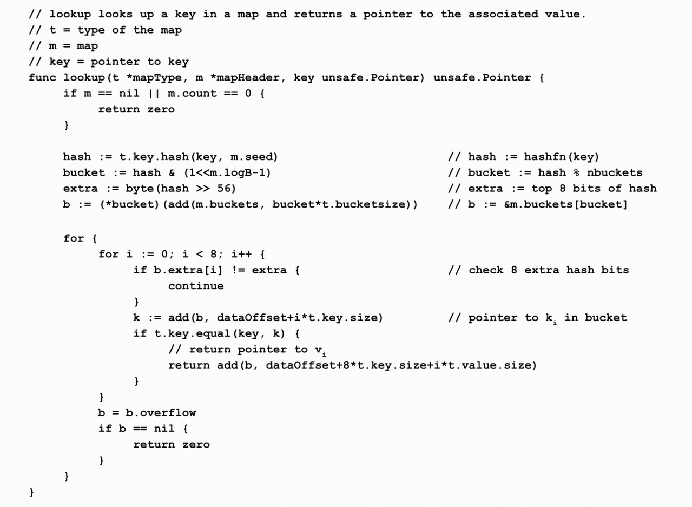

## 如何实现泛型 map

``unsafe.Pointer`` 

> all operations are done using **unsafe.Pointer**s pointing to values of generic type

```go
// src/runtime/type.go
type _type struct {
	size       uintptr
	hash       uint32
	equal func(unsafe.Pointer, unsafe.Pointer) bool
    // ...
}

type maptype struct {
	key    *_type
	elem   *_type
    // ...
}
```

## 查找



## 参考

Go Map 作者，油管视频 [GopherCon 2016: Keith Randall - Inside the Map Implementation](https://www.youtube.com/watch?v=Tl7mi9QmLns&t)

形象通透的视频[【Golang】Map长啥样儿？](https://www.bilibili.com/video/BV1Sp4y1U7dJ)

https://github.com/cch123/golang-notes/blob/master/map.md

