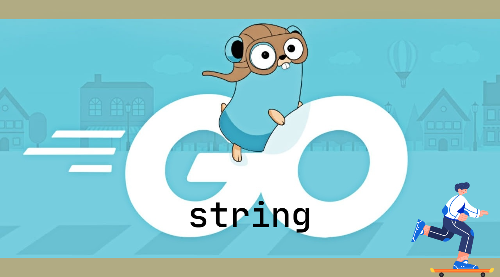

## 前言

字符串（string） 作为 go 语言的基本数据类型，在开发中必不可少，我们务必深入学习一下，做到一清二楚。

本文假设读者已经知道切片（slice）的使用，如不了解，可阅读 [Go 切片 基本知识点](https://www.cnblogs.com/yahuian/p/11521501.html#%E5%88%87%E7%89%87)

为了更好的理解后文，推荐先阅读 [Unicode 字符集，UTF-8 编码](http://c.biancheng.net/cpp/html/3420.html)

## 是什么

> In Go, a string is in effect a read-only slice of bytes.

在 go 语言中，字符串实际上是一个**只读**的**字节切片**，其数据结构定义如下：

```go
// runtime/string.go
type stringStruct struct {
	str unsafe.Pointer	// 指向底层字节数组的指针
	len int				// 字节数组的长度 
}
```

注意：byte 其实是 uint8 的类型别名

```go
// byte is an alias for uint8 and is equivalent to uint8 in all ways. It is
// used, by convention, to distinguish byte values from 8-bit unsigned
// integer values.
type byte = uint8
```

## 怎么用

```go
func main() {
	// 使用字符串字面量初始化
	var a = "hi,狗"
	fmt.Println(a)

	// 可以使用下标访问，但不可修改
	fmt.Printf("a[0] is %d\n", a[0])
	fmt.Printf("a[0:2] is %s\n", a[0:2])
	// a[0] = 'a' 编译报错，Cannot assign to a[0]
    
    // 字符串拼接
	var b = a + "狗"
	fmt.Printf("b is %s\n", b)

	// 使用内置 len() 函数获取其长度
	fmt.Printf("a's length is: %d\n", len(a))

	// 使用 for;len 遍历
	for i := 0; i < len(a); i++ {
		fmt.Println(i, a[i])
	}

	// 使用 for;range 遍历
	for i, v := range a {
		fmt.Println(i, v)
	}
}


/* output
hi,狗

a[0] is 104
a[0:2] is hi

b is hi,狗狗

a's length is: 6

0 104
1 105
2 44
3 231
4 139
5 151

0 104
1 105
2 44
3 29399
*/
```

如果读者在看上面的代码时有疑惑，不用着急，下文将会挨个解读。

## 只读

字符串常量会在编译期分配到只读段，对应数据地址不可写入，相同的字符串常量不会重复存储

```go
func main() {
	var a = "hello"
	fmt.Println(a, &a, (*reflect.StringHeader)(unsafe.Pointer(&a)))
	a = "world"
	fmt.Println(a, &a, (*reflect.StringHeader)(unsafe.Pointer(&a)))
	var b = "hello"
	fmt.Println(b, &b, (*reflect.StringHeader)(unsafe.Pointer(&b)))
}

/* output
字符串字面量 该变量的内存地址 底层字节切片
hello 0xc0000381f0 &{5033779 5}
world 0xc0000381f0 &{5033844 5}
hello 0xc000038220 &{5033779 5}
*/
```

可以看到 hello 在底层只存储了一份

## for;len 遍历

go 的源代码都是 UTF-8 编码格式的，上例中的”狗“字占用三个字节，即 231 139 151（[Unicode Character Table](https://unicode-table.com/en/72D7/)），所以上例的运行结果很清楚。

于此同时，也可以将字符串转化为字节切片

```go
func main() {
	var a = "hi,狗"
	b := []byte(a)
	fmt.Println(b)	// [104 105 44 231 139 151]
}
```

## for;range 遍历

> The Unicode standard uses the term "code point" to refer to the item represented by a single value. 

在 Unicode 标准中，使用术语 ``code point`` 来表示由单个值表示的项，通俗点来说，U+72D7（十进制表示为 29399）代表符号 ”狗“

> "Code point" is a bit of a mouthful, so Go introduces a shorter term for the concept: *rune*.

code point 有点拗口，所以在 go 语言中专门有一个术语来代表它，即 rune


注意：rune 其实是 int32 的类型别名

```go
// rune is an alias for int32 and is equivalent to int32 in all ways. It is
// used, by convention, to distinguish character values from integer values.
type rune = int32
```


在对字符串类型进行 for;range 遍历时，其实是按照 rune 类型来解码的，所以上例的运行结果也很清晰。

与此同时，也可以将字符串转化为 rune 切片

```go
func main() {
	// 使用字符串字面量初始化
	var a = "hi,狗"
	r := []rune(a)
	fmt.Println(r) // [104 105 44 29399]
}
```

当然我们也可以使用 ``"unicode/utf8"`` 标准库，手动实现 for;range 语法糖相同的效果

```go
func main() {
	var a = "hi,狗,lang"
	for i, w := 0, 0; i < len(a); i += w {
		runeValue, width := utf8.DecodeRuneInString(a[i:])
		fmt.Printf("%#U starts at byte position %d\n", runeValue, i)
		w = width
	}
}

/* output
U+0068 'h' starts at byte position 0
U+0069 'i' starts at byte position 1
U+002C ',' starts at byte position 2
U+72D7 '狗' starts at byte position 3
U+002C ',' starts at byte position 6  # 此处可以看到狗占
U+006C 'l' starts at byte position 7
U+0061 'a' starts at byte position 8
U+006E 'n' starts at byte position 9
U+0067 'g' starts at byte position 10
*/
```

## 参考

[Strings, bytes, runes and characters in Go](https://blog.golang.org/strings)

[为什么说go语言中的string是不可变的？](https://studygolang.com/topics/3727)

[字符咋存？utf8咋编码？string啥结构？](https://www.bilibili.com/video/BV1ff4y1m72A)

