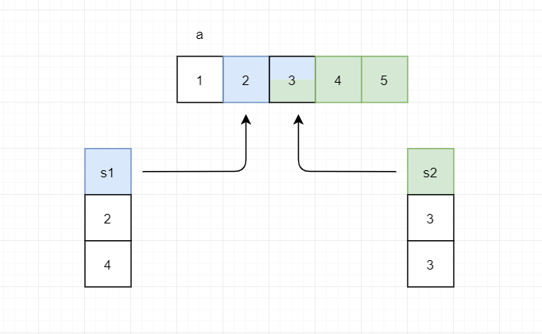
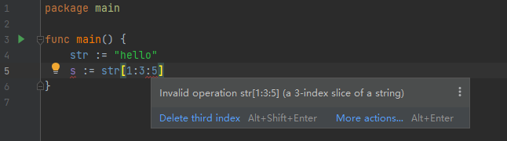

# Golang 数组 切片 字典 基本知识点

## 数组

### 数组的声明

```go
var arrayName [arraySize]dataType
eg:
var array1 [5]int
```

在声明数组时，必须指定数组名，数组长度和数组元素的类型。

### 数组的初始化

当数组定义好以后，如果没有给数组元素指定值，则所有元素被自动初始化为类型所对应的零值

```go
var array1 [5]int
// [0 0 0 0 0]
```

------

**变量的类型零值**

在Go语言中，当一个变量被定义为某一种类型后，Go语言会自动初始化其值为零（Zero Value）

零值并不等于空值，而是当变量被声明为某种类型后的默认值

|                       类型                        | 类型零值 |
| :-----------------------------------------------: | -------- |
|                       bool                        | false    |
|          int, int8, int16, int32, int64           | 0        |
|        uint, uint8, uint16, uint32, uint64        | 0        |
|                 float32, float64                  | 0        |
|               complex64, complex128               | 0+0i     |
|                    byte, rune                     | 0        |
|                      string                       | ""       |
| pointer, function, interface, slice, channel, map | nil      |

------

（1）在定义数组时对数组元素赋初值

```go
var array1 = [5]int{0, 1, 2, 3, 4}
// [0 1 2 3 4]
```

注意：花括号中的元素个数不得超过arraySize

（2）可以只给一部分元素赋初值

```go
var array1 = [5]int{0, 1, 2}
// [0 1 2 0 0]
```

注意：未赋值的默认初始化为类型零值

（3）可以由初始化列表决定数组长度

```go
var array1 = [...]int{0, 1, 2, 4, 5, 6}
// [0 1 2 4 5 6]
```

注意：

- 该例中数组长度为 ··· 标识符，表示没有指定数组长度，数组长度由初始化列表决定

- ··· 标识符不可省略，否则将变成后文将要讲的**切片**

（4）按照下标初始化元素

```go
var array1 = [5]int{0: 5, 4: 5}
// [5 0 0 0 5]
```

### 数组元素的访问和遍历

**访问**

数组元素按照下标进行访问，下标从0开始，可以是整型常量或者整型表达式

```go
var array1 = [8]int{1, 2, 3, 4, 5, 6, 7, 8}
fmt.Println(array1[0], array1[6], array1[2*3])
// 1 7 7
```

**遍历**

（1）for语句

```go
var array1 = [8]int{1, 2, 3, 4, 5, 6, 7, 8}
for i := 0; i < 8; i++ {
    fmt.Printf("%d ", array1[i])
}
// 1 2 3 4 5 6 7 8 
```

（2）for range语句

```go
var array1 = [3]int{1, 2, 3}
for i, v := range array1 {
    fmt.Printf("index is %d, value is %d.\n", i, v)
}
// index is 0, value is 1.
// index is 1, value is 2.
// index is 2, value is 3.
```

range 具有两个返回值，第一个返回值i是数组元素的下标，第二个返回值v是数组元素的值

### 二维数组

```go
var array2 = [3][4]int{{1, 2, 3, 4}, {5, 6, 7, 8}, {}} // 三行四列
fmt.Println(array2)
// [[1 2 3 4] [5 6 7 8] [0 0 0 0]]
```

## 切片

切片（slice）是数组的一个引用，它会生成一个指向数组的指针，并通过切片长度关联到底层数组部分或者全部元素。

切片中的元素是可以动态增加，删除的，所以切片通常被用来实现变长数组。

切片的数据结构原型定义如下（```Go/src/runtime/slice.go```）

```go
type slice struct {
	array unsafe.Pointer	// 指向被引用的底层数组的指针
	len   int				// 切片中元素的个数
	cap   int				// 切片分配的存储空间
}
```

### 切片的声明与创建

（1）直接创建切片

```go
var slice1 = []int{1, 2, 3, 4}
fmt.Println(slice1, len(slice1), cap(slice1))
// [1 2 3 4] 4 4
```

（2）基于底层数组创建切片

在创建切片时，可以基于一个底层数组，切片可以只使用数组的一部分元素，或者所有元素，有以下两种表达式：

- Simple slice expressions

```go
// 使用 s = a[start:end] 引用底层数组来初始化切片
// 即切片引用数组元素由 a[start] 到 a[end-1]
// start 和 end 可以省略不写，start 默认值为 0，end 默认值为 len(a)，如 a[:]
var a = [5]int{1, 2, 3, 4, 5}
s1 := a[1:3]
fmt.Println(s1, len(s1), cap(s1)) // [2 3] 2 5

s2 := a[2:]
fmt.Println(s2, len(s2), cap(s2)) // [3 4 5] 3 3


s2[0] = 8 // 注意：由于 s1 和 s2 底层的数组为同一个，所以修改 s2 也会影响 s1
fmt.Println(a)  // [1,2,8,4,5]
fmt.Println(s1) // [2,8]
fmt.Println(s2) // [8,4,5]
```



- Full slice expressions

在前一种方式中，我们无法控制新切片的容量，而使用 ``a[low : high : max]`` 表达式即可达到目的

注意：0 <= low <= high <= max <= cap(a)

```go
a := []int{1, 2, 3, 4, 5}
s1 := a[1:3]
fmt.Println(s1, len(s1), cap(s1)) // [2 3] 2 4

s2 := a[1:3:3] // 限制了切片的容量
fmt.Println(s2, len(s2), cap(s2)) // [2 3] 2 2
```

**注意**：这种方式不能用于字符串



（3）使用make函数创建切片

```go
var sliceName = make(sliceType,len,cap)
// 使用make()函数创建切片时，可以指定切片的元素个数，并且为切片元素预留存储空间
// 在后文切片的操作部分，我们会讲解指定（预估）切片容量的好处
eg:
var slice1 = make([]int, 3, 5)  // 切片的元素个数为3，切片的容量为5
fmt.Println(slice1, len(slice1), cap(slice1))
// [0 0 0] 3 5
```

### 切片元素的访问和遍历

这个和数组元素的访问以及遍历是一样的

### 切片的内置操作

（1）len()

获取切片中元素的个数

（2）cap()

获取切片的容量大小

（3）append()

使用append()函数向切片**尾部**添加新元素，这些元素保存到底层数组

```go
var s = make([]int, 3, 5)
fmt.Println(s, len(s), cap(s)) // [0 0 0] 3 5

s = append(s, 6)
s = append(s, []int{8, 8, 8}...)
fmt.Println(s, len(s), cap(s)) // [0 0 0 6 8 8 8] 7 10
```

注意：

- 与数组相比，切片多了一个**容量**的概念，即切片中元素的个数和分配的存储空间是两个不同的值

- 如果在append后，没有超过切片的容量大小，哪么容量不会发生变化

- 如果append后，超过了容量大小，则底层会重新分配一块“够大”的内存，具体的**扩容机制**可以在 ```Go\src\runtime\slice.go``` 文件中的 ```growslice``` 函数中看到

- 正如前面我们在使用make()函数创建切片时，如果我们能够预计出合理的容量大小（太大浪费内存空间，太小会不断的扩容），哪么我们在进行切片的append时，可能不会发生扩容，也就避免了切片元素的复制，减少了开销。

（4）copy()

> ```go
> // The copy built-in function copies elements from a source slice into a
> // destination slice. (As a special case, it also will copy bytes from a
> // string to a slice of bytes.) The source and destination may overlap. Copy
> // returns the number of elements copied, which will be the minimum of
> // len(src) and len(dst).
> func copy(dst, src []Type) int
> ```

```go
var slice1 = []int{1, 2, 3, 4, 5, 6}
var slice2 = make([]int, 3, 5)
num := copy(slice2, slice1)
fmt.Println(slice1)  // [1 2 3 4 5 6]
fmt.Println(slice2)  // [1 2 3]
fmt.Println(num)  // 3
```

## 字典

Map是一种特殊的数据结构，由一对无序的数据项组成，被称为键值对（Key-value Pair）

### 字典的声明

```go
var mapName map[keyType]valueType
eg:
var map1 map[string]int
// 字典声明好后必须经过初始化或者创建才能使用
// 未初始化或创建的字典值为nil
```

### 字典的初始化和创建

（1）使用 ```{}``` 操作符对字典进行初始化

```go
var map1 map[string]int
map1["egg"] = 1  // 对字典没有初始化就尝试增加数据，编译时就会报错
panic: assignment to entry in nil map

var map1 = map[string]int{} // ！！！使用{}来初始化map，也就意味着系统给map1分配了存储空间
map1["apple"] = 2  // 使用=向map中添加元素
fmt.Println(map1)  // map[apple:2]

var map1 = map[string]int{"microsoft":0}  //在初始化的时候就指定key-value元素
```

（2）使用 ```make()``` 函数来创建字典

```go
var map1 = make(map[string]int)  // 如下引用所示，我们可以指定map的长度，也可以省略
// 注意：make创建map是不可指定cap属性，当然cap()函数也不可用于map类型
map1["egg"] = 1
fmt.Println(map1) // map[egg:1]
```

> ```go
> //  Map: An empty map is allocated with enough space to hold the
> // specified number of elements. The size may be omitted, in which case
> // a small starting size is allocated.
> func make(t Type, size ...IntegerType) Type
> ```

### 字典的访问和遍历

（1）通过key来访问Value

```go
var map1 = map[string]int{"Microsoft": 0}
map1["egg"] = 1
map1["apple"] = 2
fmt.Println(map1)        // map[Microsoft:0 apple:2 egg:1]
// 通过Key来访问value
fmt.Println(map1["egg"]) // 1
```

（2）字典项查找

```go
v,ok := mapName[Key]
// 如果查找的key值存在，则将key对应的value值赋予v,ok为true
// 如果查找的key值不存在，则将v为0，ok为false
eg:
if _, ok := map1["agg"]; ok == false {
    map1["agg"] = 666
}
fmt.Println(map1) // map[Microsoft:0 agg:666 apple:2 egg:1]
```

（3）使用for,range遍历

```go
for k, v := range map1 {
    fmt.Printf("key is %s,value is %d.\n", k, v)
}
// key is Microsoft,value is 0.
// key is egg,value is 1.
// key is apple,value is 2.
// key is agg,value is 666.
```

注意：map是无序的，所以遍历的结果也是无序的。

### 字典的内置操作

（1）len()

获取字典元素的个数

（2）delete（）

> ```go
> // The delete built-in function deletes the element with the specified key
> // (m[key]) from the map. If m is nil or there is no such element, delete
> // is a no-op.
> func delete(m map[Type]Type1, key Type)
> ```

```go
var map1 = map[string]int{"Microsoft": 0}
map1["egg"] = 1
map1["apple"] = 2
fmt.Println(map1) // map[Microsoft:0 apple:2 egg:1]

delete(map1, "egg") // key存在于map1中
fmt.Println(map1)   // map[Microsoft:0 apple:2]

delete(map1, "none") // key不存在于map1中,没有任何作用，不会panic
fmt.Println(map1)    // map[Microsoft:0 apple:2]

var map2 map[string]int
delete(map2, "nil") // map2为nil，也没有任何作用,不会panic
fmt.Println(map2)   // map[]
```

## 总结

**小结**

本文简述了Go语言中最基本，最常用的三种数据结构的基本知识点，在掌握基础后，我们可以针对自己的兴趣点，去深入的研究底层的知识。

**参考资料**

[《Go语言程序设计》王鹏 编著 清华大学出版社](http://www.tup.tsinghua.edu.cn/booksCenter/book_05443601.html)

https://coolshell.cn/articles/21128.html

https://golang.org/ref/spec#Slice_expressions

