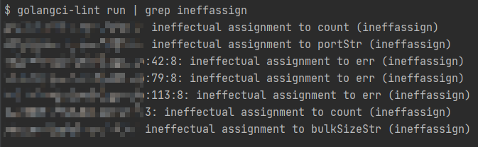
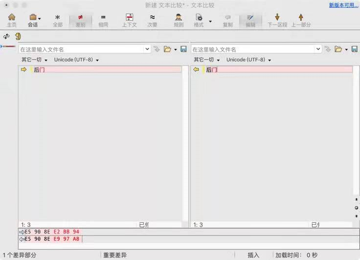
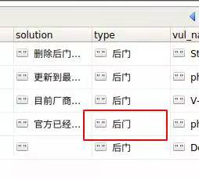

## 前言

团队协作开发中，必然存在着不同的代码风格，并且诸如 ``http body close``，``unhandled error`` 等低级错误不能完全避免。通过使用 ci lint 能够及早的发现并修复问题，提高代码质量和幸福感。

目前[主流的](https://github.com/golang/go/wiki/CodeTools#all-in-one)工具是 [golangci-lint](https://github.com/golangci/golangci-lint)，里面集成了许多的 linters，安装及使用看官网文档即可，非常详细易读，本文主要是配合一些样例代码来分析一下相关 linters 的功能。

## linters

### [deadcode](https://github.com/remyoudompheng/go-misc/tree/master/deadcode)

检查未使用的代码

```go
var a = 100

func foo() {
	println("hello,world")
}
```

```
main.go:3:5: `a` is unused (deadcode)
var a = 100
    ^
main.go:5:6: `foo` is unused (deadcode)
func foo() {
     ^
```

类似的工具还有 [structcheck](https://github.com/opennota/check)，[varcheck](https://github.com/opennota/check)

### [errcheck](https://github.com/kisielk/errcheck)

检查未处理的错误

由于 Go 语言的错误处理机制，导致代码中遍地的 ``if err != nil ``，因此有不耐烦的同学，在某些自认为不会出错的地方直接不处理，比如 ``json.Marshal()``，虽然多数情况下没啥问题，不过一但出了问题加班啥的估计跑不了。

可以通过修改[配置文件](https://golangci-lint.run/usage/linters/#errcheck)来定制不同情况是否报告

```yaml
linters-settings:
  errcheck:
<<<<<<< HEAD
	# 检查类型断言
=======
    # 检查类型断言
>>>>>>> 9ab21a59149a7c55817176b39e1784edc4c9673b
    check-type-assertions: true
    # 检查使用 _ 来处理错误
    check-blank: true
```

```go
func main() {
	foo()

	var i interface{} = 1
	ii := i.(int)
	fmt.Println(ii)

	num, _ := strconv.Atoi("110")
	fmt.Println(num)
}

func foo() error {
	return errors.New("i am error")
}
```

```
$ golangci-lint run
main.go:10:5: Error return value is not checked (errcheck)
        foo()
           ^
main.go:13:8: Error return value is not checked (errcheck)
        ii := i.(int)
              ^
main.go:16:7: Error return value of `strconv.Atoi` is not checked (errcheck)
        num, _ := strconv.Atoi("110")
             ^
```

### [gosimple](https://github.com/dominikh/go-tools/tree/master/simple)

简化代码

```go
func main() {
	t := time.Now()
	fmt.Println(time.Now().Sub(t))
}
```

```
$ golangci-lint run
main.go:10:14: S1012: should use `time.Since` instead of `time.Now().Sub` (gosimple)
        fmt.Println(time.Now().Sub(t))
                    ^
```

在[原始仓库](https://github.com/dominikh/go-tools/tree/master/simple/testdata/src)中还有许多别的测试用例，感兴趣的同学可以看看，可以修改[配置文件](https://golangci-lint.run/usage/linters/#gosimple)来指定生效的规则，默认是 all。

### [govet](https://golang.org/cmd/vet/)

go vet 是官方提供的工具，可以检查出[许多问题](https://github.com/golang/go/tree/master/src/cmd/vet/testdata)，如 printf 参数不匹配、unmarshall 时未传递指针或者接口、循环变量捕获问题等。

```go
type AAA struct {
	A int `json:"a"`
}

func main() {
	fmt.Printf("%s", true)

	var a AAA
	if err := json.Unmarshal([]byte(`{"a":1}`), a); err != nil {
		panic(err)
	}

	var s []int
	for i, v := range s {
		go func() {
			fmt.Println(i)
			fmt.Println(v)
		}()
	}
}
```

```
$ golangci-lint run
main.go:23:16: loopclosure: loop variable i captured by func literal (govet)
                        fmt.Println(i)
                                    ^
main.go:24:16: loopclosure: loop variable v captured by func literal (govet)
                        fmt.Println(v)
                                    ^
main.go:13:2: printf: fmt.Printf format %s has arg true of wrong type bool (govet)
        fmt.Printf("%s", true)
        ^
main.go:16:26: unmarshal: call of Unmarshal passes non-pointer as second argument (govet)
        if err := json.Unmarshal([]byte(`{"a":1}`), a); err != nil {
                                ^
```

### [ineffassign](https://github.com/gordonklaus/ineffassign)

检查无效的赋值，即变量赋值后并未使用

```go
func main() {
	a := os.Getenv("a")
	if a == "" {
		a = "unknown"
	}
}
```

```shell
$ golangci-lint run
main.go:8:3: ineffectual assignment to a (ineffassign)
                a = "unknown"
                ^
```

本以为这种情况应该不多，但是测试了一下我们组内的某个项目，发现还不少😂。



### [staticcheck](https://staticcheck.io/)

这个提供了更加多的[检查项目](https://staticcheck.io/docs/checks/)，包括标准库的各种误用、并发问题、测试问题、无用的代码、代码正确性问题、性能问题、代码简化、代码风格等。

```go
func main() {
	var m map[string]int
	m["a"] = 1

	if strings.ToLower("a") == strings.ToLower("A") {
		println(true)
	}
}
```

```shell
$ golangci-lint run
main.go:7:2: SA5000: assignment to nil map (staticcheck)
        m["a"] = 1
        ^
main.go:9:5: SA6005: should use strings.EqualFold instead (staticcheck)
        if strings.ToLower("a") == strings.ToLower("A") {
           ^
```

### [asciicheck](https://github.com/tdakkota/asciicheck)

检查代码中是否存在非 ASCII 的字符。

```go
type TestA struct{}
type TеstB struct{}

func main() {
	a := TestA{}
	b := TеstB{}
	println(a, b)
}
```

```
$ golangci-lint run --disable-all -E asciicheck
main.go:4:6: identifier "TеstB" contain non-ASCII character: U+0435 'е' (asciicheck)
type TеstB struct{}
     ^
```

这种的话肉眼根本无法识别，记得之前工作的时候就遇到过类似情况，你眼中的门他不一定同一个门。





### [bidichk](https://github.com/breml/bidichk)

这个和安全有关，检查危险的 unicode 字符序列，细节内容可以看[源代码特洛伊木马攻击](https://coolshell.cn/articles/21649.html/comment-page-1)。

### [bodyclose](https://github.com/timakin/bodyclose)

检查 http body 是否关闭，这种问题初学者还是非常容易犯的

```go
func main() {
	resp, err := http.Get("https://example.com/")
	if err != nil {
		panic(err)
	}
	fmt.Println(resp.Status)
}
```

```
$ golangci-lint run --disable-all -E bodyclose
main.go:9:23: response body must be closed (bodyclose)
        resp, err := http.Get("https://example.com/")
                             ^
```

### [cyclop](https://github.com/bkielbasa/cyclop)

检查代码的圈复杂度，cyclomatic complexity 是衡量代码复杂度的一种指标，值越高意味着代码复杂度越高，代码越难维护，bug 也可能更多。具体计算如下：

>  1 is the base complexity of a function
>  
>  +1 for each 'if', 'for', 'case', '&&' or '||'

默认值是 10，不过一般业务代码稍微写着写着就超了，可以修改[配置文件](https://golangci-lint.run/usage/linters/#cyclop)适当增大。

### [errorlint](https://github.com/polyfloyd/go-errorlint)

[Working with Errors in Go 1.13](https://go.dev/blog/go1.13-errors) 引入了错误包裹机制，方便函数调用过程中形成错误链，更好的定位和处理问题。

这个工具可以检查错误处理是否遵循了其标准。

```go
func main() {
	foo()
}

func foo() error {
	if _, err := os.Open("a.txt"); err != nil {
		return fmt.Errorf("call func one err: %s", err)
	}
	return nil
}
```

```shell
$ golangci-lint run --disable-all -E errorlint
main.go:14:46: non-wrapping format verb for fmt.Errorf. Use `%w` to format errors (errorlint)
                return fmt.Errorf("call func one err: %s", err)
                                                           ^
```

### [forbidigo](https://github.com/ashanbrown/forbidigo)

这个工具可以检查出指定格式的语句，比如线上代码中不应该使用 ``fmt.Println()`` 这种临时的 debug 代码，而是应该使用统一的日志组件。

```go
func main() {
	fmt.Println("debug message show remove or ues log.Println")
}
```

```shell
$ golangci-lint run --disable-all -E forbidigo
main.go:6:2: use of `fmt.Println` forbidden by pattern `^(fmt\.Print(|f|ln)|print|println)$` (forbidigo)
        fmt.Println("debug message show remove or ues log.Println")
        ^
```

### [funlen](https://github.com/ultraware/funlen)

相比于 [cyclop](https://github.com/bkielbasa/cyclop) 来说，该工具就比较直接了，可以判断函数的行数和语句是否超过某个值，

> The default limits are 60 lines and 40 statements. 

### [goconst](https://github.com/jgautheron/goconst)

可以监测出多次使用的字符串，应该用 ``const`` 来优化

### [gofumpt](https://github.com/mvdan/gofumpt)

比 ``go fmt`` 更加严格，追求更加

### [goimports](https://godoc.org/golang.org/x/tools/cmd/goimports)

对导入的包排序，这个挺重要的，避免你和同事互相打架

### [gomnd](https://github.com/tommy-muehle/go-mnd)

可以检查出代码中的魔法数字（莫名奇妙出现的数字，如果没有注释，接手的人可能完全读不懂其含义）

```go
func main() {
	var num int
	if num > 60 {
		//
	} else {
		//
	}
}
```

```
$ golangci-lint run --disable-all -E gomnd
main.go:7:11: mnd: Magic number: 60, in <condition> detected (gomnd)
        if num > 60 {
                 ^
```

一般使用常量或者枚举等可以优化，使得代码更加易读

```go
const PassingScore = 60

func main() {
	var num int
	if num > PassingScore {
		//
	} else {
		//
	}
}
```

### [gosec](https://github.com/securego/gosec)

安全相关，检查代码中可能存在的安全风险

### [noctx](https://github.com/sonatard/noctx)

检查发送 http request 时是否指定了 ``context.Context``，在涉及到网络请求时，都应该使用 context 机制将上下文串起来，这样方便做超时、链路追踪等。

### [prealloc](https://github.com/alexkohler/prealloc)

可以检查初始化 ``slice`` 时是否可以预估其容量，进而减少动态扩容时元素拷贝的性能开销

### [predeclared](https://github.com/nishanths/predeclared)

检查代码中是否有 go 预先定义好的标识符

```go
func copy(a string) string {
	return a
}

func foo() string {
	string := "x"
	return string
}
```

```shell
$ golangci-lint run --disable-all -E predeclared
main.go:7:6: function copy has same name as predeclared identifier (predeclared)
func copy(a string) string {
     ^
main.go:12:2: variable string has same name as predeclared identifier (predeclared)
        string := "x"
        ^
```

### [revive](https://github.com/mgechev/revive)

内置了许多[检查](https://github.com/mgechev/revive#available-rules)，用来替代 golint

```
task\message.go:9:6: exported: type name will be used as task.TaskMessage by other packages, and that stutters; consider calling this Message (revive)
type TaskMessage struct {
     ^
task\handler.go:16:6: exported: type name will be used as task.TaskDoneMsg by other packages, and that stutters; consider calling this DoneMsg (revive)
type TaskDoneMsg struct {
     ^
task\dispatch.go:30:6: exported: func name will be used as task.TaskDispatch by other packages, and that stutters; consider calling this Dispatch (revive)
func TaskDispatch(wg *sync.WaitGroup) {
```

检查了一下我们组某个项目的代码，发现不少类似问题，``task.TaskDispath`` 明显比 ``task.Dispath`` 冗余了许多，就像口吃，结结巴巴的说话似的。😂

### [unconvert](https://github.com/mdempsky/unconvert)

检查没有必要的类型转化

## 总结

做为工程师，我相信大家都喜欢阅读优美、高质量的代码，而不是 IDE 满篇高亮警示的代码。既然有这么多免费的 linter 帮你 review 代码，何愁代码质量无法提升？💪

## 参考

[关于静态分析的科普](https://xargin.com/static-analysis/)

https://github.com/fzipp/gocyclo

