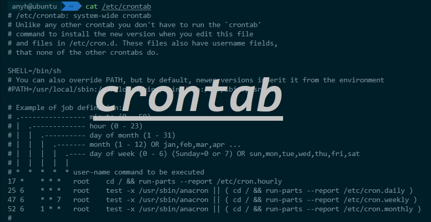
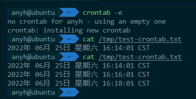
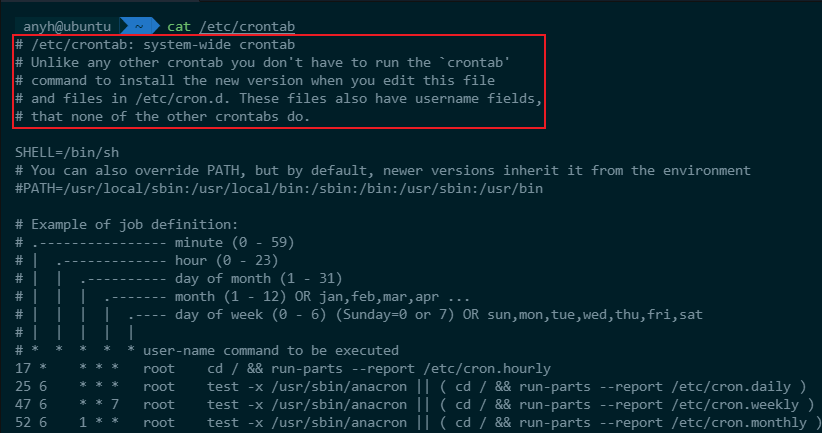
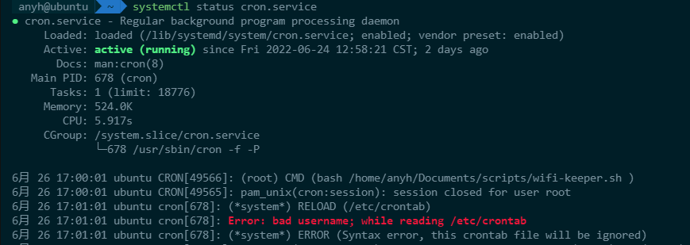

# linux crontab 定时任务详解



## 前言

正如闹钟对于日常生活的重要性一样，linux crontab 定时任务在开发中是必不可少的工具，诸如：每六个月清理一次日志，每天凌晨 12.00 重启服务等多种场景，都可以用 crontab 搞定。

本文测试环境为 Ubuntu 22.04，某些细节不同的发行版可能有所差异，以各自手册为主。

## 快速开始

友情提示：在你的 ``.bashrc`` 文件中设置你常用的编辑器，比如： ``export EDITOR=vim``，后续编辑的时候就不会弹出其他陌生的编辑器了。

输入 ``crontab -e`` 并在文件末尾输入 ``*/2 * * * * date >> /tmp/test-crontab.txt``（后续会对这句话的含义做解释，此处先不用纠结），多等待几分钟后看看 /tmp 目录下生成的 test-crontab.txt 文件中的内容。



如上图所示，我们实现了**每隔 2 分钟将当前日期追加到文件中**的功能，一行命令一句表达式，crontab 的使用就是这么简单。

在详细解释 crontab 表达式的具体含义之前，来看看其他的操作。

``crontab -l`` 查看当前运行的定时任务

``crontab -r`` 删除所有的定时任务

注意：如果要停止某个定时任务，只需要 ``-e`` 的时候使用 ``#`` 将其注释即可。

## 表达式

```
.---------------- 分 minute (0 - 59)
|  .------------- 时 hour (0 - 23)
|  |  .---------- 天 day of month (1 - 31)
|  |  |  .------- 月 month (1 - 12) OR jan,feb,mar,apr ...
|  |  |  |  .---- 周 day of week (0 - 7) (Sunday=0 or 7) OR sun,mon,tue,wed,thu,fri,sat
|  |  |  |  |
m h dom mon dow
```

### 特殊的取值

- ***** 所有，例如对于 minute 来说，* 等价于 0-59

- **,** 数组，例如 1,3,5

- **-** 段，例如 1-3 等价于 1,2,3

- **/** 间隔，例如对于 minute 来说，*/2 代表每 2 分钟

它们也可以结合在一起使用，如：1-5/2

### 特殊的写法

除了上面的表达式之外，还有类似编程语法中的语法糖，更加直白一点

```
@reboot        Run once, at startup.
@yearly        Run once a year, "0 0 1 1 *".
@annually      (same as @yearly)
@monthly       Run once a month, "0 0 1 * *".
@weekly        Run once a week, "0 0 * * 0".
@daily         Run once a day, "0 0 * * *".
@midnight      (same as @daily)
@hourly        Run once an hour, "0 * * * *".
```

### 举个例子

说的再多，不如实战几个例子来得更加清晰易懂

``5 0 * * *`` 每天的 00:05 点

``15 14 1 * *`` 每个月 1 号的 14:15

``0 22 * * 1-5`` 每周从周一到周五 22:00

虽然 crontab 不复杂，但是也没那么直白，需要大脑稍微翻译一下，并且 crontab 不太方便测试任务什么时间运行，此时借助在线的 https://crontab.guru/ 工具，我们就能写出正确的表达式，并且点击 ``next`` 还可以看到任务运行的时间点。


## 多用户管理

linux 系统是一个多用户系统，crontab 也支持多用户，默认使用当前用户，使用 ``crontab -u username`` 便可以指定其他用户。

 比如 ``sudo crontab -u root -e`` 便可编辑 root 用户的配置，不同用户的配置保存在 ``/var/spool/cron/crontabs`` 目录下。


除此之外，``/etc/cron.allow`` 文件控制哪些用户可以使用 crontab，``/etc/cron.deny`` 文件控制哪些用户不可以使用 crontab。

### 系统级的 crontab

``/etc/crontab`` 文件中设置的是一些系统级的定时任务，其中每行都多了一个执行用户，并且直接编辑该文件而不是使用 ``crontab`` 命令来管理。



## 问题排查

所有的定时任务都是由 ``cron`` 守护进程来负责调度执行的，如果任务未按照你的预期运行，可以通过 ``systemctl status cron.service`` 查看守护进程是否 running。

下图的日志还可以看到由于缺少用户名导致语法错误，一个定时任务被忽略，使用 ``journalctl -u cron.service`` 还可以查看更多的日志信息。



## 参考

``man 1 crontab``

``man 5 crontab``

``man 8 cron``

[如何在 man page 上做笔记](https://www.zhihu.com/question/36982723/answer/2543909984)

[crontab 表达式在线测试](https://crontab.guru/)

