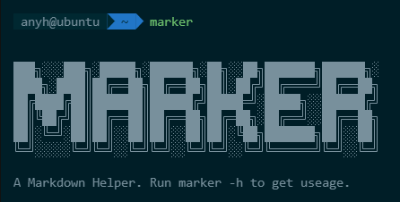
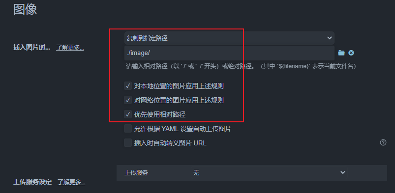
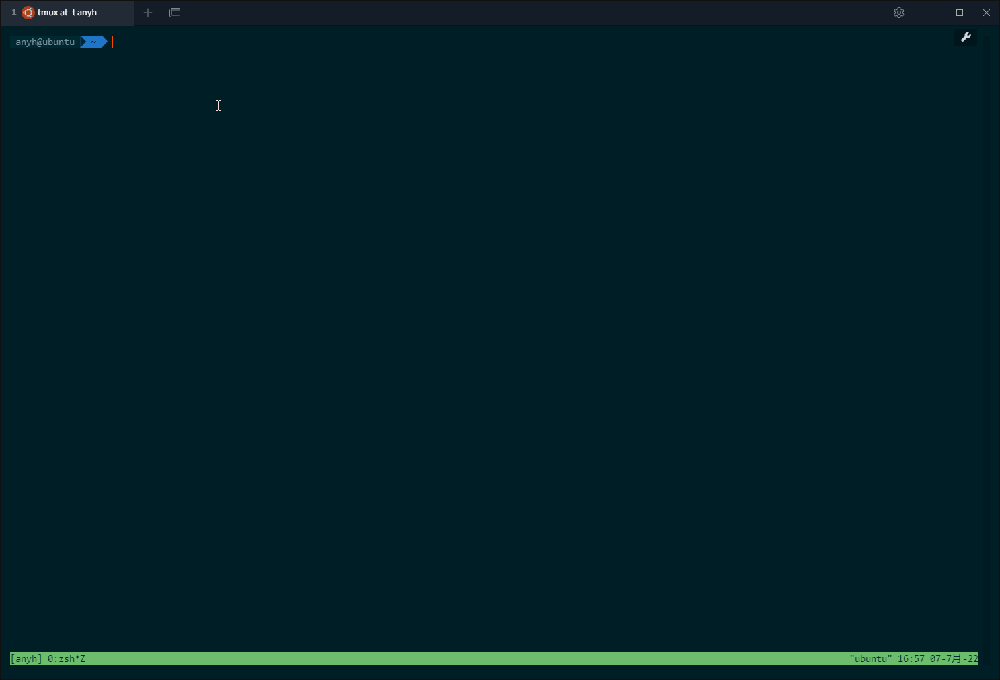
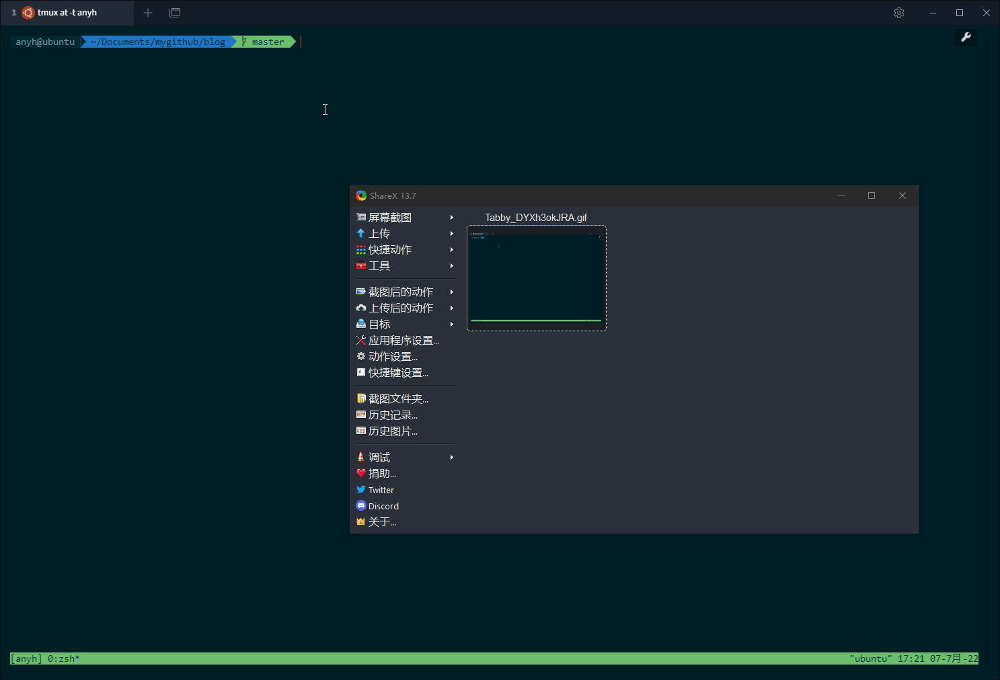

# 写了个 Markdown 命令行小工具，希望能提高园友们发文的效率！

## 前言

笔者使用 Typora 来编写 Markdown 格式的博文，图片采用的是本地相对路径存储（太懒了不想折腾图床）。

时间久了发现有两个明显的痛点：

- 删除图片时可能实际存储的图片未删除
- 上传博客园时需要一张一张手动上传图片

虽然社区中有类似的工具，但是多少感觉用着不顺手，索性自己造了个小工具。

## 删除本地未使用的图片

支持多 Markdown 文件，多层次文件嵌套！

## 批量上传图片到博客园

不会覆盖原始 Markdown 文件。

## 下载

下载地址及使用文档移步 https://github.com/YahuiAn/marker，如果有帮助到你，不妨点个 Star 鼓励我一下，感谢~

使用有任何问题欢迎提 issue。

## 参考

https://github.com/stulzq/dotnet-cnblogs-tool

https://github.com/dongfanger/pycnblog

https://github.com/cnblogs/vscode-cnb